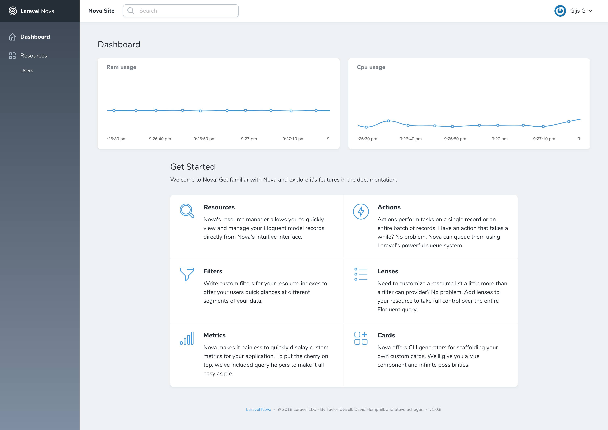

# A Laravel Nova tool to show system resources

This [Nova](https://nova.laravel.com) tool gives you a live overview of your RAM and CPU usage.



## Requirements

You must use either Linux or MacOS.

## Installation

You can install the nova tool in to a Laravel app that uses [Nova](https://nova.laravel.com) via composer:

```bash
composer require gijsg/system-resources
```

Next up, you must register the tool with Nova. This is typically done in the `cards` method of the `NovaServiceProvider`.


```php
// in app/Providers/NovaServiceProvder.php

// ...

protected function cards()
{
    return [
        // ...
        new \GijsG\SystemResources\SystemResources('ram'),
        new \GijsG\SystemResources\SystemResources('cpu'),
    ];
}
```

Specifying the width of the cards uses the nova card with notation: `1/2`, `1/4`, `full` etc.
```php
new \GijsG\SystemResources\SystemResources('ram', '1/3'),
```
The MIT License (MIT). Please see [License File](LICENSE.md) for more information.
